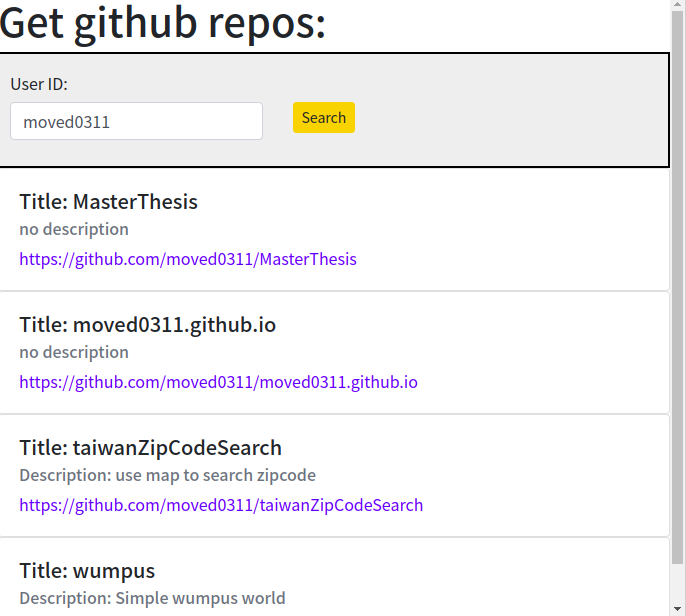

## Show github repos 
### [Demo](https://moved0311.github.io/show-github-repos/)

## Reference
* [github api REST API v3](https://developer.github.com/v3/#pagination)
* [build an Infinite Scroll Component in React using React Hooks](https://upmostly.com/tutorials/build-an-infinite-scroll-component-in-react-using-react-hooks)
* [React: setState is return an error in a scroll handler. What is breaking it?](https://stackoverflow.com/questions/53919307/react-setstate-is-return-an-error-in-a-scroll-handler-what-is-breaking-it)
* [Infinite Scrolling with jQuery](https://www.youtube.com/watch?v=76IANst0jwc)

